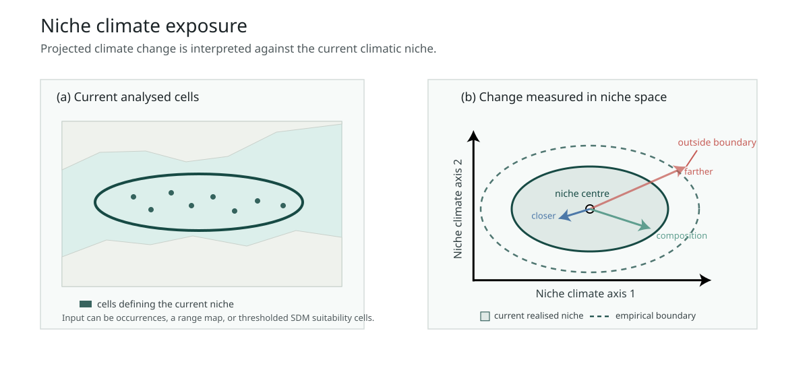

<p align="center" style="margin-top: 28px; margin-bottom: 24px;">
  
</p>

# climniche

The same magnitude of climatic change can move one site toward a species'
realised niche centre and another away from it. `climniche` resolves this
direction at each site and measures excess future distance beyond the current
empirical radial boundary.

[](https://github.com/Bohao0813/climniche/actions/workflows/R-CMD-check.yaml)
[](https://CRAN.R-project.org/package=climniche)
[](https://github.com/Bohao0813/climniche/actions/workflows/pkgdown.yaml)

Website: <https://bohao0813.github.io/climniche/>



## Installation

Install the CRAN release:

```r
install.packages("climniche")
```

CRAN currently provides version 0.0.1. This website documents development
version 0.3.7.

Install the development version from GitHub:

```r
install.packages("remotes")
remotes::install_github("Bohao0813/climniche")
```

## Niche relative geometry

The fitted object contains a geometric core and a boundary comparison. Field
names use snake case in R objects; figures and reports use the formal names
below.

- Climatic Displacement (`climate_change_amount`): distance between current
  and future conditions at the same site under the fitted climatic metric.
- Niche Distance Shift (`niche_distance_change`): signed change in distance
  from the current realised climatic niche centre.
- Climatic Reconfiguration (`climate_reconfiguration`): non-radial component
  of Climatic Displacement that is not captured by Niche Distance Shift. It is
  derived from those two quantities.
- Niche Boundary Exceedance (`niche_boundary_exceedance`): positive excess of
  future niche distance beyond the empirical radial boundary of the current
  realised climatic niche.

Climatic Displacement, Niche Distance Shift and Climatic Reconfiguration obey
the fitted geometric identity $D_i^2 = R_i^2 + C_i^2$. Climatic
Reconfiguration is therefore not an independent exposure dimension. Niche
Boundary Exceedance is a future boundary-relative state rather than a change
in boundary status.

Climate-niche factor analysis quantifies climatic departure but does not
identify whether projected conditions move toward or away from climatic means,
a limitation stated by
[Rinnan and Lawler (2019)](https://doi.org/10.1111/ecog.03937).
`climniche` adds this signed, site-level direction while retaining local
climatic displacement and an empirical radial boundary comparison.
The optional `cnfa` argument reads components from an existing CENFA object or
a compatible object; `climniche` does not call CENFA functions.

## Basic use

```r
library(climniche)

sim <- simulate_climniche()

fit <- fit_climniche(
  current = sim[["current"]],
  future = sim[["future_away"]],
  occupied = sim[["occupied"]],
  sensitivity = sim[["sensitivity"]]
)

climniche_summary(fit)
climniche_report(fit, species = "example species")
plot_climniche_summary_figure(fit)
```

`fit_climniche_raster()` and `fit_climniche_terra()` accept binary reference
rasters and continuous SDM suitability rasters. Continuous values remain
weights; `occupied_threshold` only sets values at or below the cutoff to zero.
The supplied numerical scale is used as a relative weighting scale, not as an
occurrence probability. `domain` limits the cells evaluated, while
`study_region` adds an optional boundary to maps.

## Through time

`fit_climniche_series()` holds the fitted current niche centre, climatic
weighting matrix and empirical radial boundary fixed across ordered
projections. For spatial series, future missing cells do not alter this
reference; comparisons use cells available in every projection.

```r
future <- lapply(c(0.25, 0.50, 0.75, 1), function(fraction) {
  sim[["current"]] + fraction *
    (sim[["future_away"]] - sim[["current"]])
})

series <- fit_climniche_series(
  current = sim[["current"]],
  future = future,
  time = c(2030, 2050, 2070, 2090),
  occupied = sim[["occupied"]],
  sensitivity = sim[["sensitivity"]]
)

climniche_range_summary(series)
climniche_departure(series)
plot_climniche_time(series)
```

Range summaries separate the Weighted Niche Boundary Exceedance Fraction from
Conditional Relative Niche Boundary Exceedance. Their product is Range Mean
Relative Niche Boundary Exceedance. These are weighted summaries of Niche
Boundary Exceedance, not additional cell-level exposure metrics.
Optional aggregation and raster cell area weights remain separate from the
reference weights used to estimate the realised niche.

## Ecological screening of climate exposure

`climniche_priority()` compares one climatic quantity with an ecological or
management criterion using two-objective Pareto screening. The example below
compares larger positive Niche Distance Shift with smaller Climatic
Displacement in separate screens.

```r
positive_shift <- climniche_priority(
  fit,
  exposure = "niche_distance_change",
  exposure_direction = "maximize"
)

low_displacement <- climniche_priority(
  fit,
  exposure = "climate_change_amount",
  positive_only = FALSE,
  exposure_direction = "minimize"
)
```

Each result retains the decision plane, Pareto fronts and spatial Pareto depth.
Supply an external ecological or management layer through `criterion` when the
second objective is intended to represent evidence independent of the
reference weighting surface.

## Climatic contributions

`climniche_dominant_contribution()` identifies the climate variable with the
largest absolute contribution to squared niche distance change at each cell. Its
dominance share measures how much of the total absolute contribution is
assigned to that variable. These terms decompose the squared-distance change
underlying Niche Distance Shift; they are not SDM variable importance.

```r
contribution <- climniche_dominant_contribution(fit)
summary(contribution)
```

For a spatial fit, `plot_climniche_dominant_contribution()` maps the dominant
variable and its share within the selected reference cells.

## Worked example

The [European anchovy example](https://bohao0813.github.io/climniche/articles/climniche-examples.html)
demonstrates the fitted geometry and radial boundary comparison in the
Mediterranean Sea. The
[exposure through time example](https://bohao0813.github.io/climniche/articles/climniche-through-time.html)
follows range-level exposure and persistent Niche Boundary Exceedance from
2030 to 2090. The
[ecological screening example](https://bohao0813.github.io/climniche/articles/climniche-priority.html)
contrasts larger positive Niche Distance Shift with lower Climatic
Displacement.
The [climatic contribution example](https://bohao0813.github.io/climniche/articles/climniche-contributions.html)
maps the fitted climate variables that account for squared niche distance
change.

## Contributor

Contributions are welcome. Please make a pull request or contact
bohao.he@polimi.it.
