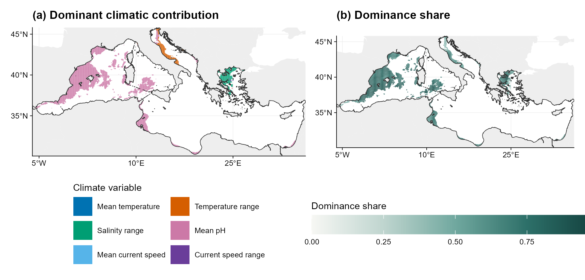

```{r, include = FALSE}
knitr::opts_chunk$set(collapse = TRUE, comment = "#>", fig.align = "center")
```

The four exposure metrics describe the magnitude and niche relative geometry
of projected climatic change. The contribution terms partition the change in
squared distance from the realised niche centre among the fitted climate
variables at each cell.

## Cell level contributions

The object `fit` is the European anchovy fit constructed in the
[Mediterranean example](climniche-examples.html). Contributions are restricted
to cells with positive current SDM suitability.

```{r contribution-code, eval = FALSE}
contribution <- climniche_dominant_contribution(
  fit,
  scope = "current"
)

summary(contribution)
head(contribution[["table"]])
```

Let $z_{0i}$ and $z_{1i}$ be the centred current and future climate vectors
for cell $i$, and let $A$ be the fitted metric matrix. The contribution of
variable $j$ is

$$
V_{ij} = z_{1ij}(A z_{1i})_j - z_{0ij}(A z_{0i})_j,
$$

so that

$$
\sum_j V_{ij} = \psi_{1i} - \psi_{0i}
               = R_i(r_{1i} + r_{0i}),
$$

where $R_i$ is Niche Distance Shift. The contribution terms therefore
attribute the squared-distance change underlying that metric. The dominant
variable has the largest $\lvert V_{ij}\rvert$. Its dominance share is

$$
H_i = \frac{\max_j \lvert V_{ij}\rvert}
           {\sum_j \lvert V_{ij}\rvert}.
$$

Values near one indicate that a single variable accounts for most of the total
absolute contribution at that cell. Equal largest contributions are retained
as ties.

## Mediterranean pattern

```{r contribution-figure-code, eval = FALSE}
variable_labels <- c(
  temperature_mean = "Mean temperature",
  temperature_range = "Temperature range",
  salinity_range = "Salinity range",
  ph_mean = "Mean pH",
  sea_water_speed_mean = "Mean current speed",
  sea_water_speed_range = "Current speed range"
)

plot_climniche_dominant_contribution(
  contribution,
  type = "both",
  variable_labels = variable_labels,
  legend_variables = names(variable_labels),
  study_region = mediterranean_boundary,
  degree_labels = "hemisphere"
)
```

```{r contribution-figure-output, echo = FALSE, out.width = "100%"}

```

Panel (a) maps the variable with the largest absolute contribution and retains
all six fitted climate variables in its legend.
Panel (b) maps the dominant variable's share of the total absolute contribution
at the same cell. Mean pH has the largest absolute term in most cells with
positive anchovy reference weight. Temperature range and salinity range have
the largest term in smaller, geographically distinct areas.

The weighted dominance frequency is the reference-weighted fraction of cells
with non-zero contribution for which a variable is uniquely dominant.

```{r contribution-summary, echo = FALSE}
library(climniche)

case_path <- system.file("extdata/mediterranean_anchovy", package = "climniche")
contribution_summary <- read.csv(
  file.path(case_path, "anchovy_climniche_dominant_contributions.csv")
)
contribution_summary <- contribution_summary[, c(
  "label", "mean_absolute_share", "dominant_weight_fraction"
)]
names(contribution_summary) <- c(
  "Climate variable", "Mean absolute share", "Weighted dominance frequency"
)
knitr::kable(contribution_summary, digits = 3, row.names = FALSE)
```

These contributions decompose future minus current squared niche distance.
They do not estimate SDM variable importance or causal climatic effects. When
the fitted metric matrix is non-diagonal, each variable contribution also
contains its allocated cross-variable terms in the fitted climatic basis.
