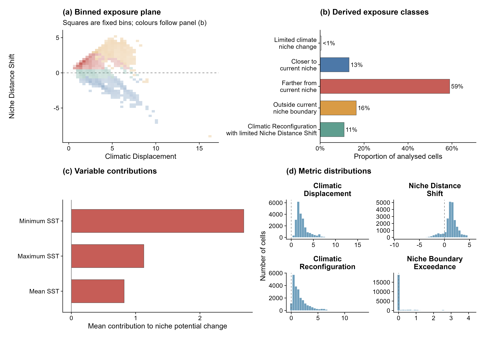

```{r, include = FALSE}
knitr::opts_chunk$set(collapse = TRUE, comment = "#>", fig.align = "center")
```

This page uses the Mediterranean anchovy case study from the package data. The
case study is based on a Mediterranean analysis domain, current and projected
sea-surface temperature variables, and an SDM-derived current reference area for
European anchovy (*Engraulis encrasicolus*).

```{r}
library(climniche)

case_path <- system.file("extdata/mediterranean_anchovy", package = "climniche")
summary_tab <- read.csv(file.path(case_path, "anchovy_climniche_summary.csv"))
class_tab <- read.csv(file.path(case_path, "anchovy_climniche_classes.csv"))
variable_tab <- read.csv(file.path(case_path, "anchovy_climniche_top_variables.csv"))
records <- read.csv(file.path(case_path, "anchovy_clean_obis_records.csv"))
```

The included tables keep the vignette small while recording the fitted case.
The full raster workflow used the same package functions shown below.

```{r}
summary_tab[, c(
  "n", "boundary_quantile", "mean_climate_change_amount",
  "mean_niche_distance_change", "prop_niche_divergence",
  "prop_niche_exceedance", "prop_niche_convergence"
)]

head(class_tab)
head(variable_tab)
nrow(records)
```

## Mediterranean maps

The map panel shows the data structure used for interpretation: current
suitability, Climatic Displacement, Niche Distance Shift, Climatic
Reconfiguration, Niche Boundary Exceedance, change alignment, and exposure
class.
The four metrics are continuous quantities. The exposure classes are derived
after fitting by applying the classification thresholds to those metrics; they
are not a one-to-one set of four metric categories.

```{r, echo = FALSE, out.width = "100%"}
knitr::include_graphics("figures/anchovy-mediterranean-maps.png")
```

The map is limited to the Mediterranean analysis domain. The current reference
cells are taken from the SDM suitability layer; exposure is evaluated at those
cells and interpreted against the realised niche estimated from the same
reference set.
Continuous suitability values are used as reference weights in the fitted
niche centre, empirical niche boundary and current-scope summaries.

## Summary figure

`plot_climniche_showcase()` combines the binned exposure plane, exposure class
proportions, variable contributions, and distributions of the four metrics.

```{r, echo = FALSE, out.width = "95%"}

```

The Mediterranean case identifies sea-surface temperature minima, maxima, and
mean conditions as the variables with the largest positive contributions to
niche potential change. The class table gives the exposure classes numerically.

```{r}
class_tab[, c("class", "proportion")]
variable_tab[, c("variable", "mean_contribution", "interpretation")]
```

## Fitting the same data structure

For a raster workflow, current and future environmental layers must have the
same geometry. The occupied layer can be binary or continuous. With a continuous
SDM layer, `occupied_threshold` removes low suitability values. Values above the
threshold remain continuous reference weights.

```r
fit <- fit_climniche_raster(
  current = current_sst_stack,
  future = future_sst_stack,
  occupied = anchovy_sdm_suitability,
  occupied_threshold = 0.40,
  domain = mediterranean_domain,
  sensitivity = c(sst_min = 1, sst_mean = 1, sst_max = 1),
  boundary = 0.95,
  tolerance_quantile = 0.10,
  stable_quantile = 0.25,
  stable_reconfiguration_quantile = 0.25,
  boundary_exceedance_tolerance = 0,
  conflict_ratio = 0.25
)

climniche_summary(fit)
plot_climniche_map(fit, metric = "niche_distance_change",
                   occupied = anchovy_sdm_suitability,
                   occupied_only = TRUE,
                   occupied_threshold = 0.40)
plot_climniche_classes(fit, occupied = anchovy_sdm_suitability,
                       occupied_only = TRUE,
                       occupied_threshold = 0.40)
plot_climniche_showcase(fit)
```

For a matrix workflow, extract current and future environmental values first and
pass the current reference cells as a logical vector, row indices, or a
continuous suitability vector.

```r
fit <- fit_climniche(
  current = current_values,
  future = future_values,
  occupied = sdm_suitability,
  occupied_threshold = 0.40,
  sensitivity = c(sst_min = 1, sst_mean = 1, sst_max = 1),
  boundary = 0.95
)
```
