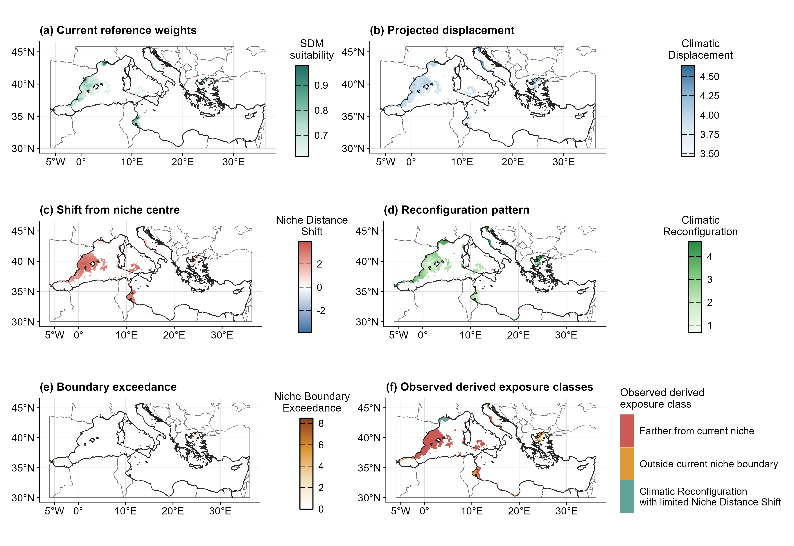
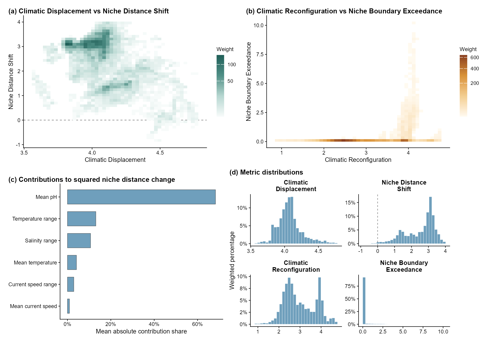

```{r, include = FALSE}
knitr::opts_chunk$set(collapse = TRUE, comment = "#>", fig.align = "center")
```

This vignette analyses European anchovy (*Engraulis encrasicolus*) in the
Mediterranean Sea using Bio-ORACLE v3 surface layers, OBIS occurrences and a
continuous suitability surface fitted with presence-background data.

```{r}
library(climniche)

case_path <- system.file("extdata/mediterranean_anchovy", package = "climniche")

# Prepared tables stored with the package.
metric_summary <- read.csv(
  file.path(case_path, "anchovy_climniche_metric_summary.csv")
)
variable_contributions <- read.csv(
  file.path(case_path, "anchovy_climniche_variable_contributions.csv")
)
layer_manifest <- read.csv(
  file.path(case_path, "anchovy_biooracle_layer_manifest.csv")
)
sdm_settings <- read.csv(
  file.path(case_path, "anchovy_presence_background_sdm_settings.csv")
)
fit_settings <- read.csv(
  file.path(case_path, "anchovy_climniche_fit_settings.csv")
)
sensitivity_weights <- read.csv(
  file.path(case_path, "anchovy_climniche_sensitivity_weights.csv")
)
predictor_screen <- read.csv(
  file.path(case_path, "anchovy_predictor_correlation_vif_screen.csv")
)
```

## Prepared inputs

The environmental data are Bio-ORACLE v3 surface layers. Baseline time layers
were averaged for current conditions; future rasters use the same variables
under SSP2-4.5 at the 2050 time coordinate.

```{r}
# Use readable scenario labels in the printed table.
layer_table <- layer_manifest
layer_table[["future_scenario"]] <- "SSP2-4.5"

unique(layer_table[, c(
  "depth", "current_time", "future_scenario", "future_time"
)])

subset(layer_table, retained_for_climniche, c(
  "label", "depth", "current_time", "future_scenario", "future_time"
))
```

The current reference layer is a continuous suitability raster from a
presence-background SDM. Background cells are sampled Mediterranean cells
outside occurrence cells; they are not confirmed absences. The maximum TSS
threshold removes low suitability cells from the reference set. Suitability
values above the threshold remain continuous weights.

```{r}
subset(
  sdm_settings,
  setting == "presence_cell_count" |
    setting == "background_cell_count" |
    setting == "background_to_presence_ratio" |
    setting == "sdm_test_auc" |
    setting == "sdm_test_tss" |
    setting == "sdm_threshold"
)
```

Predictor screening was completed before the `climniche` fit. The retained
variables are:

```{r}
climniche_predictors <- subset(
  predictor_screen,
  role == "climniche exposure calculation" & retained
)

subset(climniche_predictors, retained, c("label", "vif_after_screening"))
```

## Fit the exposure model

The prepared Bio-ORACLE layers are terra rasters. The suitability raster enters
the fit as a continuous reference layer; the maximum TSS cutoff removes low
suitability values without converting the retained values to one.

The diagonal metric for this case study uses the ratio of current-domain
variance to occurrence-cell variance, bounded between 0.25 and 4 and rescaled
to mean one.

```{r}
sensitivity_weights
```

```{r fit-code, eval = FALSE}
# Use the maximum TSS threshold to remove low suitability cells.
threshold_row <- subset(sdm_settings, setting == "sdm_threshold")
sdm_threshold <- as.numeric(threshold_row[["value"]])

# Keep the Bio-ORACLE variables retained after predictor screening.
climniche_predictors <- subset(
  predictor_screen,
  role == "climniche exposure calculation" & retained
)
selected_predictors <- climniche_predictors[["variable"]]
predictor_labels <- setNames(
  climniche_predictors[["label"]],
  selected_predictors
)
predictor_sensitivity <- setNames(
  sensitivity_weights[["sensitivity_weight"]],
  sensitivity_weights[["variable"]]
)

# The suitability raster supplies continuous reference weights.
fit <- fit_climniche_terra(
  current = current_layers[[selected_predictors]],
  future = future_layers[[selected_predictors]],
  occupied = anchovy_suitability,
  occupied_threshold = sdm_threshold,
  domain = mediterranean_sea_mask,
  sensitivity = predictor_sensitivity
)

climniche_summary(fit)
```

## Niche-relative decomposition

The fit returns four quantities. Climatic Displacement is the distance from
current to future conditions under the fitted climatic metric. Niche Distance
Shift is the signed change in distance from the current realised niche centre.
Climatic Reconfiguration is the remaining non radial component, calculated
from the identity
$D_i^2 = R_i^2 + C_i^2$.
Niche Boundary Exceedance is the positive excess of future niche distance
beyond the empirical radial boundary of the current realised climatic niche.

If $r_{0i}$ and $r_{1i}$ are the current and future distances from the
niche centre and $\theta_i$ is the angle between their centred climatic
vectors, then

$$
C_i^2 = 2r_{0i}r_{1i}\left[1 - \cos(\theta_i)\right].
$$

Climatic Reconfiguration therefore combines angular change with current and
future distances from the niche centre. It is calculated from Climatic
Displacement and Niche Distance Shift rather than fitted independently.

```{r}
subset(
  fit_settings,
  setting == "boundary_quantile" |
    setting == "tolerance" |
    setting == "boundary_exceedance_tolerance"
)

metric_summary[, c(
  "n", "reference_weight_sum", "boundary_quantile",
  "mean_climate_change_amount", "mean_niche_distance_change",
  "prop_beyond_niche_boundary", "mean_niche_boundary_exceedance"
)]
```

The variable contributions sum to future minus current squared niche distance.
They are not SDM variable importance or causal effects.

```{r}
variable_contributions
```

## Mediterranean maps

The map figure shows the four continuous reported quantities within the
current SDM suitable area.

```{r mediterranean-maps-code, eval = FALSE}
metric_maps <- plot_climniche_maps(
  fit,
  occupied = anchovy_suitability,
  occupied_only = TRUE,
  occupied_threshold = sdm_threshold,
  study_region = mediterranean_boundary,
  degree_labels = "hemisphere",
  legend_title = FALSE,
  legend_position = "bottom"
)

metric_maps
```

```{r mediterranean-maps-figure, echo = FALSE, out.width = "100%"}

```

## Summary figure

The summary figure uses one weighted plane for Climatic Displacement and Niche
Distance Shift and a second for Climatic Reconfiguration and Niche Boundary
Exceedance. Panel (c) shows each climatic variable's mean absolute contribution
share to the squared-distance change underlying Niche Distance Shift. Panel
(d) shows weighted distributions of the four reported quantities.
The [spatial climatic contribution example](climniche-contributions.html)
maps the cell-level pattern underlying panel (c).

```{r summary-figure-code, eval = FALSE}
summary_figure <- plot_climniche_summary_figure(
  fit,
  scope = "current",
  top_variables = 6,
  variable_labels = predictor_labels,
  title = NULL
)

summary_figure
```

```{r summary-figure-output, echo = FALSE, out.width = "95%"}

```

The [exposure through time example](climniche-through-time.html) extends this
fit to four SSP2-4.5 projection years while retaining the same current niche
reference.
