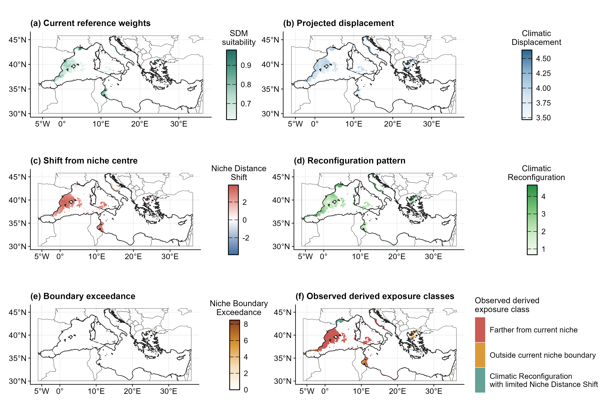
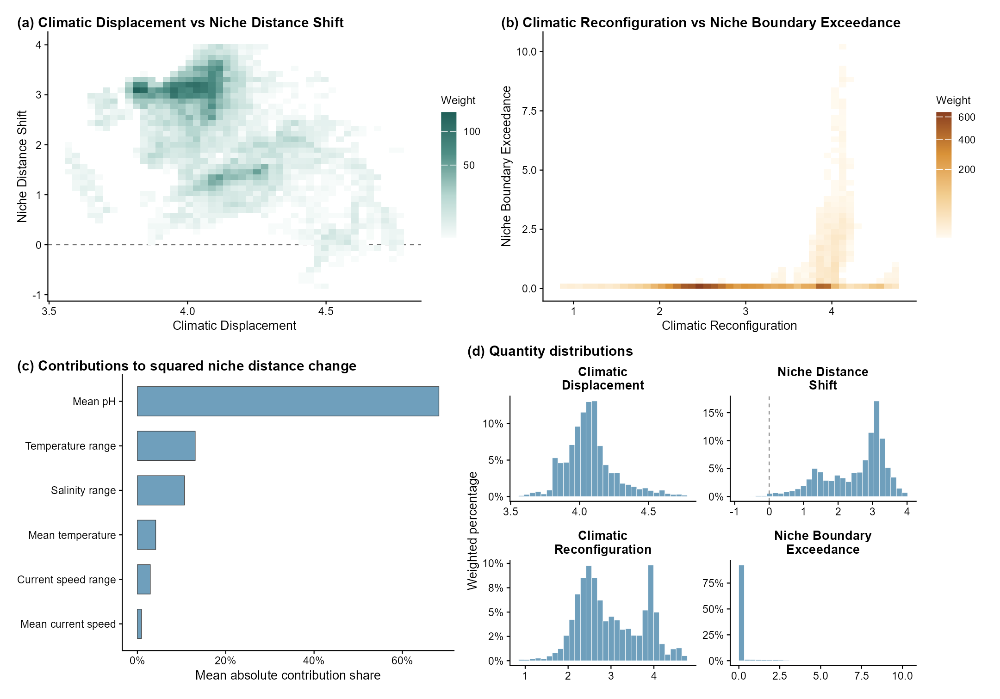

```{r, include = FALSE}
knitr::opts_chunk$set(collapse = TRUE, comment = "#>", fig.align = "center")
```

This example evaluates projected climate exposure for European anchovy
(*Engraulis encrasicolus*) in the Mediterranean Sea. Current and SSP2-4.5
conditions use six Bio-ORACLE v3 surface variables. A continuous
presence-background SDM supplies the current reference weights.

```{r}
library(climniche)

case_path <- system.file("extdata/mediterranean_anchovy", package = "climniche")

case_cells <- read.csv(
  file.path(case_path, "anchovy_climniche_input_sample.csv"),
  check.names = FALSE
)
layer_manifest <- read.csv(
  file.path(case_path, "anchovy_biooracle_layer_manifest.csv")
)
sdm_settings <- read.csv(
  file.path(case_path, "anchovy_presence_background_sdm_settings.csv")
)
metric_weights <- read.csv(
  file.path(case_path, "anchovy_climniche_sensitivity_weights.csv")
)
```

## Climatic data

The six retained variables describe temperature, salinity, pH and water
movement. Current and future layers have identical variables, resolution and
cell order.

```{r}
variable_table <- subset(
  layer_manifest,
  retained_for_climniche,
  c("variable", "label", "depth", "current_time", "future_time")
)
variable_table[["future_scenario"]] <- "SSP2-4.5"
variable_table
```

The diagonal climatic metric uses the ratio of current-domain variance to
occurrence-cell variance, bounded to 0.25-4 and normalised to mean one. These
weights define the relative distance scale for this case study; they are not
physiological sensitivity estimates.

```{r}
weight_table <- merge(
  variable_table[c("variable", "label")],
  metric_weights[c("variable", "sensitivity_weight")],
  by = "variable",
  sort = FALSE
)
names(weight_table) <- c(
  "Variable", "Climate variable", "Climatic metric weight"
)
weight_table
```

The package contains a 2,000-cell extract of the prepared raster inputs so that
the central calculation runs when this vignette is built. The maps later in
the vignette come from the full Mediterranean raster analysis.

```{r}
climate_variables <- variable_table[["variable"]]
current_columns <- paste0(climate_variables, "_current")
future_columns <- paste0(climate_variables, "_future")

current_climate <- as.matrix(case_cells[current_columns])
future_climate <- as.matrix(case_cells[future_columns])
colnames(current_climate) <- climate_variables
colnames(future_climate) <- climate_variables

weight_row <- sdm_settings[["setting"]] == "sdm_threshold"
sdm_threshold <- as.numeric(sdm_settings[weight_row, "value"])
climatic_weights <- setNames(
  metric_weights[["sensitivity_weight"]],
  metric_weights[["variable"]]
)
```

## Niche relative exposure

Suitability values at or below the SDM threshold receive zero reference
weight. Values above the threshold retain their continuous values.

```{r}
anchovy_fit <- fit_climniche(
  current = current_climate,
  future = future_climate,
  occupied = case_cells[["sdm_suitability"]],
  occupied_threshold = sdm_threshold,
  sensitivity = climatic_weights,
  preprocess = FALSE
)

climniche_summary(anchovy_fit)
```

Let current and future climatic conditions at cell $i$ be $c_i$ and
$f_i$, the current realised niche centre be $\mu$, and the fitted climatic
distance be $d_A$. The reported quantities are

$$
\begin{aligned}
D_i &= d_A(f_i,c_i),\\
R_i &= d_A(f_i,\mu)-d_A(c_i,\mu),\\
C_i &= \sqrt{\max(0,D_i^2-R_i^2)},\\
E_i &= \max(0,d_A(f_i,\mu)-B_q).
\end{aligned}
$$

Climatic Displacement ($D_i$) and Niche Distance Shift ($R_i$) form the
primary geometric pair. Climatic Reconfiguration ($C_i$) is derived from
them as the non-radial component of Climatic Displacement; it is not an
independently estimated process. Niche Boundary Exceedance ($E_i$) compares
the future distance with the weighted empirical radial boundary $B_q$.

The identity can be checked directly from the fitted object.

```{r}
geometry_error <- with(
  anchovy_fit,
  climate_change_amount^2 -
    niche_distance_change^2 -
    climate_reconfiguration^2
)
max(abs(geometry_error))
```

Niche Boundary Exceedance describes the future boundary-relative state. A
positive value is an excess distance beyond $B_q$; it does not by itself
show that the cell crossed the boundary between current and future conditions.

## Mediterranean maps

The full raster workflow uses the same climatic variables and reference
weights.

```{r mediterranean-maps-code, eval = FALSE}
spatial_fit <- fit_climniche_terra(
  current = current_layers[[climate_variables]],
  future = future_layers[[climate_variables]],
  occupied = anchovy_suitability,
  occupied_threshold = sdm_threshold,
  domain = mediterranean_sea_mask,
  sensitivity = climatic_weights,
  preprocess = FALSE
)

metric_maps <- plot_climniche_maps(
  spatial_fit,
  occupied = anchovy_suitability,
  occupied_only = TRUE,
  occupied_threshold = sdm_threshold,
  study_region = mediterranean_boundary,
  degree_labels = "hemisphere",
  legend_title = FALSE,
  legend_position = "bottom"
)

metric_maps
```

```{r mediterranean-maps-figure, echo = FALSE, out.width = "100%"}

```

## Summary figure

Panel (a) shows the primary geometric pair. Panel (b) places the derived
Climatic Reconfiguration term against the boundary-relative future state.
Panel (c) gives each climatic variable's mean absolute share of the change in
squared niche distance. These are climatic distance contributions, not SDM
variable importance. Panel (d) shows the weighted distributions of the
reported quantities.

```{r summary-figure-code, eval = FALSE}
variable_labels <- setNames(
  variable_table[["label"]],
  variable_table[["variable"]]
)

summary_figure <- plot_climniche_summary_figure(
  spatial_fit,
  scope = "current",
  top_variables = 6,
  variable_labels = variable_labels,
  title = NULL
)

summary_figure
```

```{r summary-figure-output, echo = FALSE, out.width = "95%"}

```

The [exposure through time example](climniche-through-time.html) applies the
same fixed current niche reference to four SSP2-4.5 projections. The
[spatial climatic contribution example](climniche-contributions.html) maps the
cell-level pattern summarized in panel (c).

## Data sources

Bio-ORACLE v3 layers follow Assis et al. (2024),
[*Global Ecology and Biogeography* 33,
e13813](https://doi.org/10.1111/geb.13813). Occurrence records were obtained
from the [Ocean Biodiversity Information System](https://obis.org/). The study
region uses Marine Regions IHO Sea Areas version 3
([doi:10.14284/323](https://doi.org/10.14284/323)).
