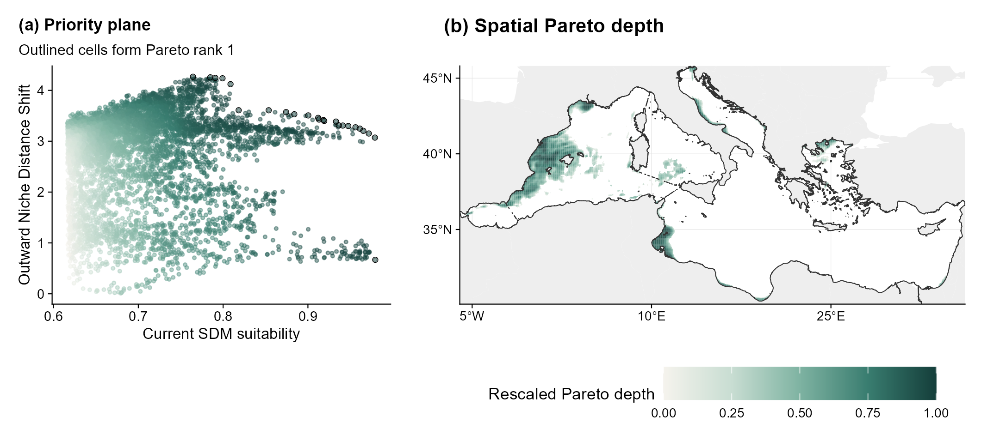

```{r, include = FALSE}
knitr::opts_chunk$set(collapse = TRUE, comment = "#>", fig.align = "center")
```

This example continues the Mediterranean European anchovy analysis. It ranks
current reference cells by two explicit objectives: current SDM suitability
and outward Niche Distance Shift.

## Why two objectives

Climatic Displacement, Niche Distance Shift and Climatic Reconfiguration are
linked by the fitted geometric identity. Entering all four reported quantities
as independent decision criteria would count related information more than
once. The priority analysis therefore pairs one selected exposure quantity
with one reference or decision criterion.

Pareto rank 1 contains cells for which no retained cell is at least as high on
both objectives and higher on one. Removing that front and repeating the
comparison gives ranks 2, 3 and subsequent fronts. No tradeoff weight is fitted
between the two objectives.

## Rank the anchovy reference cells

The object `fit` below is the spatial fit constructed in the
[European anchovy example](climniche-examples.html). Negative Niche Distance
Shift is excluded because this analysis asks where conditions move away from
the realised niche centre.

```{r priority-code, eval = FALSE}
priority <- climniche_priority(
  fit,
  exposure = "niche_distance_change",
  criterion_name = "Current SDM suitability",
  scope = "current",
  positive_only = TRUE
)

priority
summary(priority)
priority_table <- priority[["table"]]
included_cells <- priority_table[["included"]]
head(priority_table[included_cells, ])
```

```{r priority-summary, echo = FALSE}
library(climniche)

case_path <- system.file("extdata/mediterranean_anchovy", package = "climniche")
priority_summary <- read.csv(
  file.path(case_path, "anchovy_climniche_priority_summary.csv")
)
priority_summary <- data.frame(
  Statistic = c(
    "Ranked cells", "Pareto fronts", "First front cells",
    "First front fraction", "Spearman correlation between objectives"
  ),
  Value = c(
    format(priority_summary[["ranked_cells"]], big.mark = ","),
    format(priority_summary[["pareto_fronts"]], big.mark = ","),
    format(priority_summary[["first_front_cells"]], big.mark = ","),
    sprintf("%.2f%%", 100 * priority_summary[["first_front_fraction"]]),
    sprintf("%.3f", priority_summary[["objective_rank_correlation"]])
  )
)
knitr::kable(priority_summary, row.names = FALSE)
```

## Priority plane and map

The outlined points in panel (a) form the first Pareto front. Panel (b) maps
Pareto depth after rescaling it from zero to one; cells on the same front retain
the same value.

```{r priority-figure-code, eval = FALSE}
priority_figure <- plot_climniche_priority(
  priority,
  type = "both",
  map_value = "relative_priority",
  study_region = mediterranean_boundary,
  degree_labels = "hemisphere"
)

priority_figure
```

```{r priority-figure-output, echo = FALSE, out.width = "100%"}

```

Here, current SDM suitability is the same continuous surface used to weight the
realised climatic niche. It is not an independent measure of population value.
A separate abundance, habitat condition, irreplaceability or management cost
layer can instead be supplied through `criterion`.

```{r independent-criterion, eval = FALSE}
priority_with_value <- climniche_priority(
  fit,
  exposure = "niche_boundary_exceedance",
  criterion = conservation_value,
  criterion_name = "Conservation value",
  criterion_direction = "maximize"
)
```

The same function can examine Climatic Reconfiguration or Climatic
Displacement, but each choice answers a different screening question. The map
is not a substitute for a spatial conservation plan that includes
representation, connectivity, cost and feasibility.

The non-dominated ranking follows the spatial multi-criteria application of
[Tracey et al. (2018)](https://doi.org/10.1371/journal.pone.0200203).
