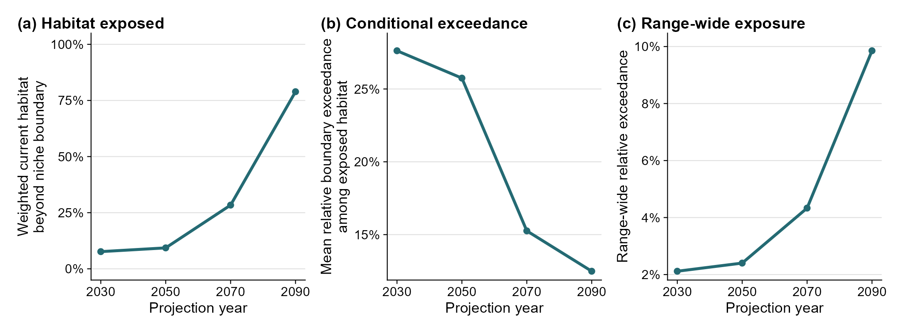
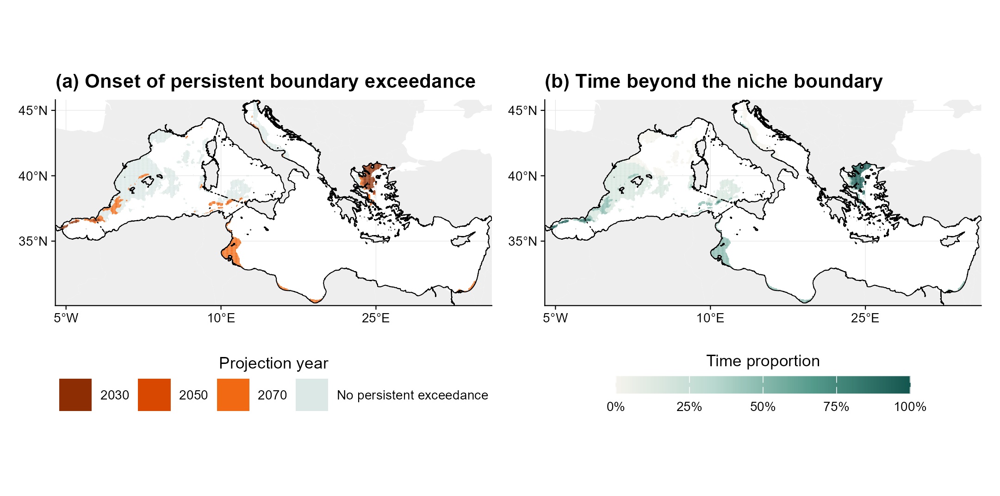

```{r, include = FALSE}
knitr::opts_chunk$set(collapse = TRUE, comment = "#>", fig.align = "center")

library(climniche)

case_path <- system.file("extdata/mediterranean_anchovy", package = "climniche")
range_summary <- read.csv(
  file.path(case_path, "anchovy_climniche_time_range_summary.csv")
)
departure_summary <- read.csv(
  file.path(case_path, "anchovy_climniche_time_departure_summary.csv")
)
change_rate <- read.csv(
  file.path(case_path, "anchovy_climniche_time_change_rate.csv")
)
```

A single future period cannot show whether climatic exposure expands gradually
across current habitat or intensifies within places that were already exposed.
This example follows European anchovy (*Engraulis encrasicolus*) in the
Mediterranean Sea at 2030, 2050, 2070 and 2090 under Bio-ORACLE SSP2-4.5.

## Fit one climatic reference

The analysis uses the six Bio-ORACLE variables and the continuous anchovy
suitability layer prepared in the
[Mediterranean example](climniche-examples.html). The current realised
climatic niche is fitted once. Its centre, sensitivity weighted metric and
empirical boundary are then held fixed across all four projections.

```{r series-fit, eval = FALSE}
projection_years <- c(2030, 2050, 2070, 2090)

future_series <- list(
  ssp245_2030 = climate_2030,
  ssp245_2050 = climate_2050,
  ssp245_2070 = climate_2070,
  ssp245_2090 = climate_2090
)

# Project each period into the same fitted climatic niche.
series <- fit_climniche_series(
  current = current_climate,
  future = future_series,
  time = projection_years,
  scenario = "SSP2-4.5",
  occupied = anchovy_suitability,
  occupied_threshold = sdm_threshold,
  domain = mediterranean_sea_mask,
  sensitivity = predictor_sensitivity
)
```

The order of the future list must match `time`. Current and future rasters use
the same variables, names, resolution and cell alignment.

## Range-level exposure

The temporal summaries are derived from Niche Boundary Exceedance. They do not
add further cell-level exposure metrics. Let \(E_{it}\) denote Niche Boundary
Exceedance for cell \(i\) at time \(t\), \(B\) the fitted niche boundary
distance and \(w_i\) the product of current suitability weight and cell area.
For the zero boundary tolerance used here,

$$
F_t =
\frac{\sum_i w_i I(E_{it} > 0)}
     {\sum_i w_i}
$$

is the fraction of weighted current habitat beyond the niche boundary,

$$
S_t =
\frac{\sum_i w_i (E_{it}/B) I(E_{it} > 0)}
     {\sum_i w_i I(E_{it} > 0)}
$$

is mean relative exceedance among exposed habitat, and

$$
M_t =
\frac{\sum_i w_i (E_{it}/B) I(E_{it} > 0)}
     {\sum_i w_i}
= F_t S_t
$$

is range-wide relative exceedance.

```{r range-code, eval = FALSE}
range_summary <- climniche_range_summary(
  series,
  scope = "current",
  area_weight = TRUE
)

subset(
  range_summary,
  select = c(
    time,
    exposed_fraction,
    conditional_relative_exceedance,
    range_wide_relative_exceedance
  )
)
```

```{r range-table, echo = FALSE}
range_table <- data.frame(
  `Projection year` = range_summary[["time"]],
  `Current habitat beyond boundary` = paste0(
    round(100 * range_summary[["exposed_fraction"]], 1),
    "%"
  ),
  `Relative exceedance among exposed habitat` = paste0(
    round(100 * range_summary[["conditional_relative_exceedance"]], 1),
    "%"
  ),
  `Range-wide relative exceedance` = paste0(
    round(100 * range_summary[["range_wide_relative_exceedance"]], 1),
    "%"
  ),
  check.names = FALSE
)

knitr::kable(range_table, row.names = FALSE)
```

```{r range-figure-code, eval = FALSE}
extent_plot <- plot_climniche_time(
  series,
  metric = "exposed_fraction",
  scope = "current",
  area_weight = TRUE,
  show_models = FALSE
)

conditional_plot <- plot_climniche_time(
  series,
  metric = "conditional_relative_exceedance",
  scope = "current",
  area_weight = TRUE,
  show_models = FALSE
)

range_plot <- plot_climniche_time(
  series,
  metric = "range_wide_relative_exceedance",
  scope = "current",
  area_weight = TRUE,
  show_models = FALSE
)

patchwork::wrap_plots(
  extent_plot,
  conditional_plot,
  range_plot,
  nrow = 1
)
```

```{r range-figure-output, echo = FALSE, out.width = "100%"}

```

Weighted habitat beyond the boundary increases from 7.7% in 2030 to 78.9% in
2090. Conditional relative exceedance falls from 27.6% to 12.5% over the same
period. This combination is consistent with many newly exposed cells lying
just beyond the boundary. Range-wide relative exceedance nevertheless rises
from 2.1% to 9.9%.

## Persistent boundary exceedance

Here, persistence requires positive Niche Boundary Exceedance in at least two
consecutive projections. The onset is the first sampled year in a qualifying
run; it is not an interpolated date of boundary crossing.

```{r departure-code, eval = FALSE}
departure <- climniche_departure(
  series,
  scope = "current",
  persistence = 2
)

rate <- climniche_change_rate(
  series,
  metric = "range_wide_relative_exceedance",
  scope = "current",
  area_weight = TRUE
)
```

```{r departure-summary, echo = FALSE}
departure_table <- data.frame(
  `Persistent boundary exceedance` = paste0(
    round(
      100 * departure_summary[["proportion_with_persistent_departure"]],
      1
    ),
    "%"
  ),
  `Median onset` = departure_summary[["median_first_persistent_departure"]],
  `Mean time beyond boundary` = paste0(
    round(100 * departure_summary[["mean_departure_time_fraction"]], 1),
    "%"
  ),
  `Re-entry` = paste0(
    round(100 * departure_summary[["proportion_with_reentry"]], 1),
    "%"
  ),
  check.names = FALSE
)

knitr::kable(departure_table, row.names = FALSE)
```

```{r departure-map-code, eval = FALSE}
onset_map <- plot_climniche_departure_map(
  series,
  metric = "first_persistent_departure",
  scope = "current",
  persistence = 2,
  scenario = "SSP2-4.5",
  study_region = mediterranean_boundary,
  degree_labels = "hemisphere"
)

duration_map <- plot_climniche_departure_map(
  series,
  metric = "departure_time_fraction",
  scope = "current",
  persistence = 2,
  scenario = "SSP2-4.5",
  study_region = mediterranean_boundary,
  degree_labels = "hemisphere"
)

patchwork::wrap_plots(onset_map, duration_map, nrow = 1)
```

```{r departure-map-output, echo = FALSE, out.width = "100%"}

```

By 2090, 28.4% of weighted current habitat has persistent boundary exceedance
across at least two sampled projections, with a median onset in 2070. The
earliest persistent exceedance occurs mainly in the Aegean, while later onset
extends through parts of the western and south-central Mediterranean. No
re-entry is identified in this four-period series.

The largest increase in range-wide relative exceedance occurs between 2070 and
2090:

```{r rate-table, echo = FALSE}
rate_row <- subset(
  change_rate,
  metric == "range_wide_relative_exceedance"
)
rate_table <- data.frame(
  `Interval start` = rate_row[["interval_start"]],
  `Interval end` = rate_row[["interval_end"]],
  `Increase in range-wide exposure` = paste0(
    round(100 * rate_row[["maximum_interval_increase"]], 1),
    " percentage points"
  ),
  check.names = FALSE
)

knitr::kable(rate_table, row.names = FALSE)
```

## Report

`climniche_series_report()` collects the fixed niche reference, projections,
range summaries, persistent boundary exceedance summary and interval changes.

```{r series-report, eval = FALSE}
series_report <- climniche_series_report(
  series,
  species = "European anchovy",
  scope = "current",
  area_weight = TRUE,
  persistence = 2
)

series_report
write_climniche_series_report(
  series_report,
  "anchovy-exposure-through-time.md"
)
```
